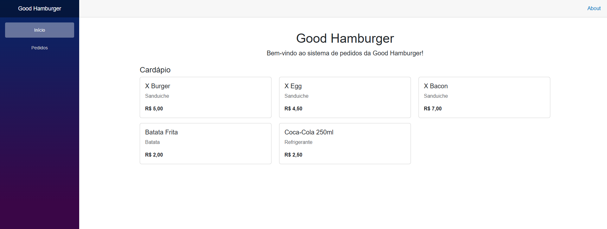
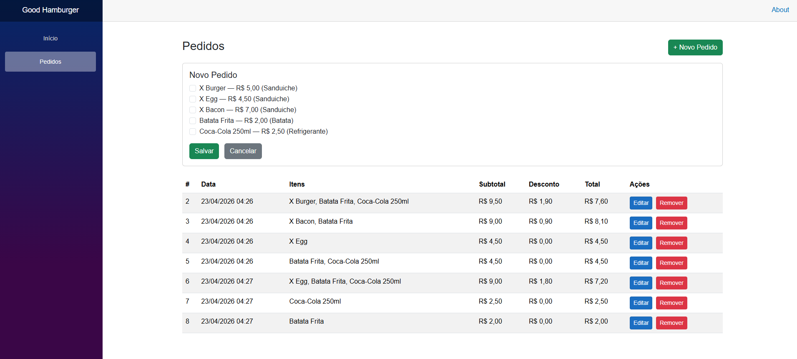
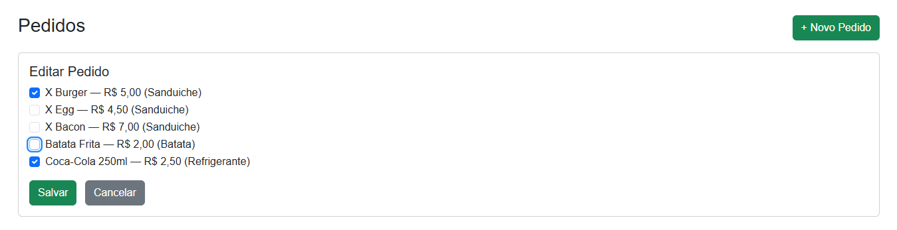

# Good Hamburger

Sistema de gerenciamento de pedidos para lanchonete - Good Hamburger.

---

## Tecnologias Utilizadas

- .NET 9
- ASP.NET Core Web API
- Entity Framework Core 9 com SQLite
- AutoMapper 15
- FluentValidation 12
- Scalar (documentação da API)
- Blazor WebAssembly (frontend)
- xUnit + Moq (testes unitários)

---

## Arquitetura e Decisões Técnicas

O projeto foi organizado em uma Solution com três projetos distintos:

- `GoodHamburger.API` — responsável por toda a lógica de negócio e exposição dos endpoints REST
- `GoodHamburger.Blazor` — frontend em Blazor WebAssembly que consome a API
- `GoodHamburger.Tests` — projeto de testes unitários isolado, seguindo a convenção do ecossistema .NET

### Estrutura da API

A API segue a arquitetura em camadas Controller → Service → Repository, com separação clara de responsabilidades:

- **Controllers** — recebem as requisições HTTP e delegam para os Services
- **Services** — contêm a lógica de negócio, incluindo o cálculo de descontos
- **Repositories** — responsáveis pelo acesso ao banco de dados via Entity Framework
- **DTOs** — separam o modelo de domínio do contrato da API
- **Mappers** — mapeamento entre entidades e DTOs via AutoMapper
- **Utils** — classe utilitária com responsabilidades bem definidas: `ValidadorPedido` para validação das regras de negócio e `CalculadoraPedido` para o cálculo de subtotal, desconto e total
- **Validators** — validação da estrutura das requisições via FluentValidation, aplicada automaticamente via Action Filter global
- **Filters** — `ValidacaoFilter` intercepta requisições antes de chegarem nos controllers e retorna mensagens claras em caso de dados inválidos

### Regras de Negócio

Cada pedido pode conter no máximo um sanduíche, uma batata e um refrigerante. Itens duplicados são rejeitados com mensagem de erro clara. As regras de desconto seguem a tabela abaixo:

| Combinação                        | Desconto     |
| --------------------------------- | ------------ |
| Sanduíche + Batata + Refrigerante | 20%          |
| Sanduíche + Refrigerante          | 15%          |
| Sanduíche + Batata                | 10%          |
| Demais combinações                | Sem desconto |

### Validação em Duas Camadas

A validação foi implementada em duas camadas complementares. O FluentValidation valida a estrutura da requisição (lista nula, IDs inválidos, duplicatas por ID). O `ValidadorPedido` valida as regras de negócio após consulta ao banco (item inexistente no cardápio, mais de um item do mesmo tipo). Essa separação garante respostas claras e responsabilidades bem definidas.

### Banco de Dados

Foi utilizado SQLite com Entity Framework Core. A escolha pelo SQLite foi intencional: como o banco de dados não era um requisito do desafio, optou-se pela solução que oferece a menor fricção possível para a avaliação do projeto.

O cardápio é populado automaticamente via seed configurado no `OnModelCreating`, garantindo que os cinco itens estejam disponíveis desde a primeira execução.

A relação entre `Pedido` e `Item` é muitos-para-muitos, implementada com a tabela intermediária `PedidoItens`, permitindo que o mesmo item do cardápio apareça em vários pedidos distintos sem conflito.

### Padrões e Boas Práticas

- Commits seguindo o padrão Conventional Commits (`feat:`, `fix:`, `chore:`)
- Interfaces em todas as camadas de Service e Repository, favorecendo inversão de dependência e testabilidade
- Método de validação utilizando o padrão Strategy, onde cada regra de negócio é um item de uma lista — facilitando a extensão sem modificar o método principal
- Injeção de dependência via `AddScoped` em toda a aplicação

### Testes

Os testes unitários cobrem exclusivamente as regras de negócio, que é onde reside a complexidade do domínio. Foram testados todos os métodos do `PedidoService`, incluindo validações, cálculos de desconto e comportamento em cenários de erro. Os testes utilizam o padrão AAA (Arrange, Act, Assert), Moq para mock do repositório, banco em memória para o contexto e um `ItemMock` para centralizar a criação de dados de teste.

---

## Telas do Sistema

### Página Inicial com Cardápio



### Gerenciamento de Pedidos



### Edição de Pedido



---

## Pré-requisitos

- .NET 9 SDK
- dotnet-ef (ferramenta de linha de comando do Entity Framework)

Para instalar a ferramenta do EF:

```bash
dotnet tool install --global dotnet-ef
```

---

## Como Executar

### 1. Clonar o repositório

```bash
git clone https://github.com/tiagosaraivadev/GoodHamburguer.git
cd GoodHamburger
```

### 2. Executar a API no terminal

```bash
cd GoodHamburger.API
dotnet restore
dotnet ef database update
dotnet run
```

### 3. Executar o Frontend (em outro terminal)

```bash
cd GoodHamburger.Blazor
dotnet restore
dotnet run
```

O frontend estará disponível em `http://localhost:5120`.

---

## Observações sobre Portas

As portas estão configuradas nos arquivos `launchSettings.json` de cada projeto. Caso haja conflito de porta no ambiente de avaliação, basta ajustar os valores em:

- `GoodHamburger.API/Properties/launchSettings.json`
- `GoodHamburger.Blazor/Properties/launchSettings.json`

Lembre-se de atualizar também a configuração de CORS no `Program.cs` da API e a `BaseAddress` do `HttpClient` no `Program.cs` do Blazor para refletir as novas portas.

---

## O que Foi Deixado Fora

- **Autenticação e autorização** — não fazia parte do escopo do desafio
- **Paginação na listagem de pedidos** — optou-se por manter a solução simples dado o contexto
- **Testes de integração** — foram implementados apenas testes unitários das regras de negócio, que é onde reside a complexidade do domínio. Testes de controller e repository foram omitidos intencionalmente
- **Docker** — não incluído pois o SQLite elimina a necessidade de infraestrutura adicional
